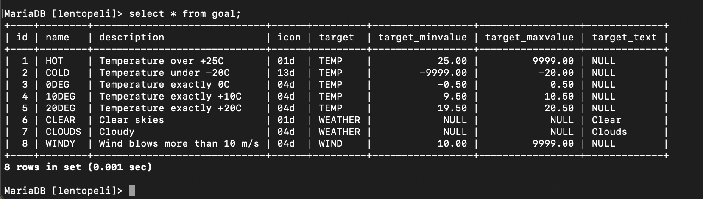

# VIIKKO 1

# Relaatiokannan peruskäsitteiden harjoitukset

Tenttivastaukset:

1. 5
2. 5
3. ident
4. varchar
5. iso_country
6. country
7. iso_country
8. varchar
9. 70942
10. iso_country
11. varchar
12. 248
13. goal
14. 0DEG
15. id
16. epätosi
17. game
18. game
19. game
20. game
21. id
22. location
23. goal_reached
24. goal_id, game_id
25. 2

# VIIKKO 2

# Yhteen tauluun kohdistuvat kyselyt

Tehtävä 1 Tee kysely, joka tulostaa kaikki sarakkeet goal-talusta.

Vastaus:

select * from goal;

