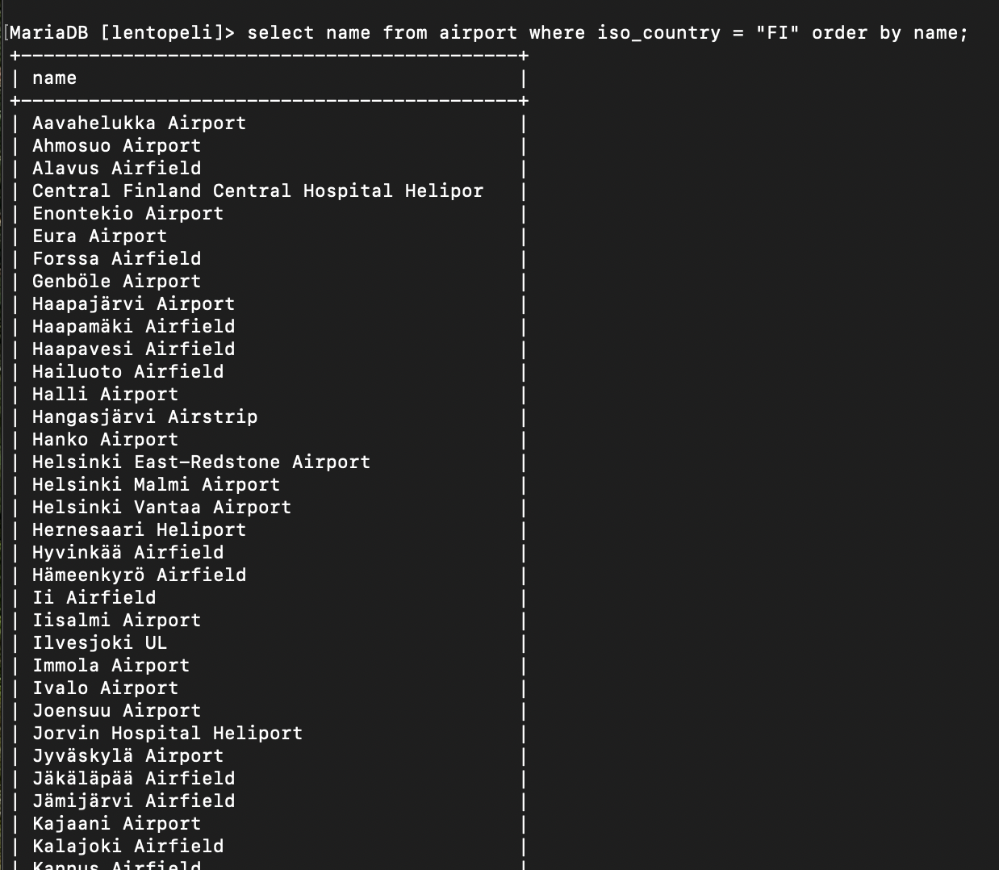
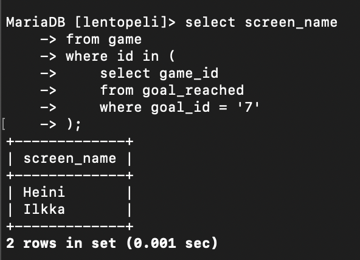

# VIIKKO 1

# Relaatiokannan peruskäsitteiden harjoitukset

Tenttivastaukset:

1. 5
2. 5
3. ident
4. varchar
5. iso_country
6. country
7. iso_country
8. varchar
9. 70942
10. iso_country
11. varchar
12. 248
13. goal
14. 0DEG
15. id
16. epätosi
17. game
18. game
19. game
20. game
21. id
22. location
23. goal_reached
24. goal_id, game_id
25. 2

# VIIKKO 2: YHTEEN TAULUUN KOHDISTUVAT KYSELYT

# Tehtävä 1: Tee kysely, joka tulostaa kaikki sarakkeet goal-talusta.

Vastaus:

select * from goal;

Tuloste:

# Tehtävä 2: Tee kysely, joka tulostaa nimen ja tyypin kaikista Suomessa sijaitsevista lentokentistä. 
# Suomen maatunnus on: FI

Vastaus:

select name, type from airport where iso_country = "FI";

Tuloste:

Huom. ei sisällä kaikkia rivejä tilantarpeen vuoksi.

# Tehtävä 3: Tee kysely, joka tulostaa suomalaisten lentokenttien nimet aakkosjärjestyksessä. 
# Suomen maatunnus: FI

Vastaus:

select name from airport where iso_country = "FI" order by name;

Tuloste:

Huom. ei sisällä kaikkia rivejä tilantarpeen vuoksi.

# Tehtävä 4: Tee kysely, joka tulostaa nimen ja tyypin kaikista Suomessa sijaitsevista lentokentistä. 
# Järjestä tulos ensisijaisesti tyypin mukaan ja toissijaisesti nimen mukaan.

Vastaus:

select name, type from airport where iso_country = "FI" order by type, name;

Tuloste:

Huom. ei sisällä kaikkia rivejä tilantarpeen vuoksi.

# Tehtävä 5: Tee kysely, joka tulostaa kaikki F-kirjaimella alkavat maan nimet country-taulusta.

Vastaus:

select name from country where name like 'F%';

Tuloste:

# Tehtävä 6: Tee kysely, joka tulostaa kaikki country-taulun maiden nimet, joissa esiintyy F-kirjain.

Vastaus:

select name from country where name like '%f%';

Tuloste:

# Tehtävä 7: Missä locationissa Vesa sijaitsee?

Vastaus:

select location from game where screen_name = 'Vesa';

Tuloste:

# Tehtävä 8: Kuinkan paljon Ilkka on kuluttanut CO2 budjettia?

Vastaus:

select co2_consumed from game where screen_name = 'Ilkka';

Tuloste:

# Tehtävä 9: Kuinka paljon alkuperäinen CO2 budjetti on (tulosta CO2 budjetin arvo vain kerran)?

Vastaus:

select co2_budget from game where id = '1';

Tuloste:

# VIIKKO 2: WHERE-OSAN LIITOSEHTO

# Tehtävä 1: Tee kysely, joka listaa maan nimen ja lentokentän nimen. Valitse maaksi Islanti
# ja anna country-taulun name-kentälle alias ”country name” ja airport taulun name-kentälle 
# alias ”airport name”.
# Vihje: Tarvitset lainausmerkit aliakseen, koska sinulla on kaksi erillistä sanaa. 
# Käytettävä maan nimi on ”Iceland”.

Vastaus:

select country.name as 'country name', airport.name as 'airport name'
from country, airport
where airport.iso_country = country.iso_country
and country.name = 'Iceland';

Tuloste:

Huom. ei sisällä kaikkia rivejä tilantarpeen vuoksi.

# Tehtävä 2: Listaa Ranskan isojen lentokenttien nimet. Anna kentän nimelle alias "airport name".
# Vihje: Käytettävä maan nimi on "France".

Vastaus:

select country.name as 'country name', airport.name as 'airport name'
from country, airport
where airport.iso_country = country.iso_country
and country.name = 'France'
and airport.type = 'large_airport';

Tuloste:

# Tehtävä 3: Tee kysely, joka listaa kaikki Antarktiksella sijaitsevien lentokenttien nimet
# ja vastaava maan nimi. Käytä aliaksia country_name ja airport_name. 
# SQLLite ei salli kahdesta sanasta koostuvaa aliasta. 
# MariaDB sallii jos aliaksen ympärillä on lainausmerkit.
# Vihje: Continent = "AN"

Vastaus:

select country.continent as 'country_name', airport.name as 'airport_name'
from country, airport
where airport.iso_country = country.iso_country
and country.continent = 'AN';

Tuloste:

Huom. ei sisällä kaikkia rivejä tilantarpeen vuoksi.

# Tehtävä 4: Kuinka korkealla Heini on paraikaa merenpinnasta mitattuna?

Vastaus:

select elevation_ft
from airport, game
where game.location = airport.ident
and screen_name = 'Heini';

Tuloste:

# Tehtävä 5: Kuinka korkealla Heini on paraikaa merenpinnasta mitattuna? 
# Anna tulos metreissä, ja anna tulokselle alias elevation_m. Yksi jalka on 0,3048 metriä. 
# Älä käytä muuttujaa. Voit kuitenkin tehdä laskutoimituksen ilman muuttujaa.

select elevation_ft * 0.3048 as 'elevation_m'
from airport, game
where game.location = airport.ident
and screen_name = 'Heini';

Tuloste:

# Tehtava 6: Minkä nimisellä lentokentällä Ilkka on?

Vastaus:

select name
from airport, game
where game.location = airport.ident
and screen_name = 'Ilkka';

Tuloste:

# Tehtävä 7: Minkä nimisessä maassa Ilkka on?

Vastaus:

select country.name as name
from airport, game, country
where game.location = airport.ident
and airport.iso_country = country.iso_country
and screen_name = 'Ilkka';

Tuloste:

# Tehtävä 8: Minkä nimiset säätila-tavoitteet Heini on saavuttanut?

Vastaus:

select goal.name as name
from goal, goal_reached, game
where goal_reached.goal_id = goal.id
and goal_reached.game_id = game.id
and game.screen_name = 'Heini';

Tuloste:

# Tehtävä 9: Minkä nimisellä lentokentällä Ilkka saavutti säätilan clouds?

Vastaus:

select airport.name as name
from airport, game, goal_reached, goal
WHERE game.location = airport.ident
  and game.id = goal_reached.game_id
  and goal_reached.goal_id = goal.id
  and game.screen_name = 'Ilkka';

Tuloste:

# Tehtävä 10: Minkä nimisessä maassa Ilkka saavutti säätilan clouds?

Vastaus:

select country.name as name
from country, airport, game, goal_reached, goal
where country.iso_country = airport.iso_country
and airport.ident = game.location
and game.id = goal_reached.game_id
and goal_reached.goal_id = goal.id
and game.screen_name = 'Ilkka'
and goal.name = 'CLOUDS';

Tuloste:

# VIIKKO 3: JOIN

# Tehtävä 1: Luettele suomalaiset lentokentät, joilla on aikataulutettuja palveluja. 
# Lopputulokseen halutaan sekä maan nimi että lentokentän nimi.
# Vihje 1: Tarvittava maan nimi on ”Finland”.
# Vihje 2: Kahdesta sanasta koostuvaan aliakseen tarvitset lainausmerkit ympärille.

Vastaus:

select country.name as 'country name', airport.name as 'airport name'
from airport
inner join country on airport.iso_country = country.iso_country
where scheduled_service = 'yes'
and country.name = 'Finland';

Tuloste:

# Tehtävä 2: Luettele pelaajanimet ja niiden lentokentrien nimet, joilla he ovat nyt.

Vastaus:

select game.screen_name as 'screen name', airport.name as name
from game
inner join airport on game.location = airport.ident;

Tuloste:

# Tehtävä 3: Luettele pelaajanimet ja maat, joissa he ovat nyt.

Vastaus:

select game.screen_name as screen_name, country.name as name
from airport
inner join game on game.location = airport.ident
inner join country on airport.iso_country = country.iso_country;

Tuloste:

# Tehtävä 4: Luette kaikkien niiden lentokenttien nimet, jotka sisältävät merkkijonon "Hels" 
# ja pelaajan nimi, jos joku pelaaja sattuu ko. kentällä olemaan.

Vastaus:

select airport.name as name, game.screen_name as screen_name
from airport
left join game on airport.ident = game.location
where airport.name like '%Hels%';

Tuloste:

# Tehtävä 5: Luettele kaikki säätilatavoitteiden nimet ja pelaajan nimi, jos pelaaja on sen saavuttanut.

Vastaus:

select goal.name as name, game.screen_name as screen_name
from goal
left join goal_reached on goal_reached.goal_id = goal.id
left join game on goal_reached.game_id = game.id;

Tuloste:

# VIIKKO 3: SISÄKYSELYT

# Tehtävä 1: Minkä nimisessä maassa sijaitsee sanalla ”Satsuma” alkava lentokenttä?

Vastaus:

select country.name as name
from country
where iso_country in(
      select iso_country
      from airport
      where airport.name like 'Satsuma%'
);

Tuloste:

# Tehtävä 2: Luettele Monacossa sijaitsevien lentokenttien nimet.

Vastaus:

select name 
from airport
where iso_country in(
        select iso_country
        from country
        where name = 'Monaco'
);

Tuloste:

# Tehtävä 3: Luettele nimimerkit, jotka ovat saavuttaneet säätilatavoitteen pilvistä (CLOUDS).

Vastaus:

select screen_name
from game
where id in (
    select game_id
    from goal_reached
    where goal_id = '7'
);

Tuloste:

# Tehtövö 4: Luettele kaikki maat, joissa ei ole lentokenttää.
# Vihje: Tarvitset negaatiota NOT IN.

Vastaus:

select name
from country
where iso_country not in (
        select iso_country
        from airport
);

Tuloste:

# Tehtävä 5: Minkä nimiset säätilatavoitteet Heiniltä on saavuttamatta?
# Vihje: Tarvitset negaatiota NOT IN.

Vastaus:

select name
from goal
where id not in (
        select goal_id
        from goal_reached
        where game_id in (
                select id 
                from game
                where screen_name = 'Heini'
        )       
);

Tuloste:

# VIIKKO 4: Koostetietokyselyt

# Tehtävä 1: Kuinka korkealla sijaitsee korkeimmalla sijaitseva lentokenttä?

Vastaus:

select max(elevation_ft)
from airport;

Tuloste:

# Tehtävä 2: Tee kysely, joka listaa kunkin maanosan, ja niissä sijaitsevien maiden määrän.

Vastaus:

select continent, count(*)
from country
group by continent;

Tuloste:

# Tehtävä 3: Tulosta pelaajien nimimerkit ja pelaajien saavuttamien säätilatavoitteiden lukumäärät.

Vastaus:

select screen_name, count(*)
from game, goal_reached 
where id = game_id
group by screen_name;

Tuloste:

# Tehtävä 4: Mikä nimimerkki on kuluttanut vähiten hiilijalanjälkeä?
# Vihje2: Vaikka kysely kohdistuu yhteen tauluun tarvitset sisäkyselyä.

Vastaus:

select screen_name
from game 
where co2_consumed = (select min(co2_consumed) from game);

Tuloste:

# Tehtävä 5: Tulosta maan nimi ja lentokenttien lukumäärä kyseisessä maassa. Järjestä tulokset siten, 
# että ylimpänä listassa ovat maat, joissa on eniten lentokenttiä. 
# Ota mukaan vain 50 eniten lentokenttiä sisältävää maata.

Vastaus:

select country.name as name, count(*)
from country
inner join airport on country.iso_country = airport.iso_country
group by country.name 
order by count(*) desc
limit 50;

Tuloste:

Huom. ei sisällä kaikkia rivejä tilantarpeen vuoksi.

# Tehtävä 6: Tulosta niiden maiden nimi, joissa on yli 1000 lentokenttää.
# Vihje: Tee ryhmittely iso_country-kentän avulla. (Ei maan nimellä)

Vastaus:

select country.name as name
from country
inner join airport on country.iso_country = airport.iso_country
group by country.iso_country
having count(*) > 1000;

Tuloste:

# Tehtävä 7: Minkä niminen on maailman korkeimmalla sijaitseva lentokenttä?
# Vihje1: Älä käytä desc limit, jos meillä on useampi lentokenttä yhtä korkealla; 
# desc limit poimii niistä vain yhden. Me haluamme kaikki korkeimmalla sijaitsevat lentokentät.
# Vihje2: Vaikka kysely kohdistuu yhteen tauluun tarvitset sisäkyselyä.

Vastaus:

select name
from airport
having max(elevation_ft);

Tuloste:

# Tehtävä 8: Missä maassa sijaitsee maailman korkeimmalla oleva lentokenttä?
# Vihje1: Älä käytä desc limit, jos meillä on useampi lentokenttä yhtä korkealla; 
# desc limit poimii niistä vain yhden. Me haluamme kaikki korkeimmalla sijaitsevien lentokenttien maat.
# Vihje 2: Sisäkyselyt ovat käteviä tähän.

Vastaus:

select country.name as name
from country
inner join airport on country.iso_country = airport.iso_country
where airport.elevation_ft = (
    select max(elevation_ft)
    from airport
)
group by country.iso_country;

Tuloste:

# Tehtävä 9: Kuinka monta säätilatavoitetta Vesa on saavuttanut?

Vastaus:

select count(*)
from goal_reached
inner join game on goal_reached.game_id = game.id
where screen_name = 'Vesa';

Tuloste:

# Tehtävä 10: Mikä on lähimpänä napa-alueita olevan lentokentän nimi?
# Vihje: Latitude on 0 molemmissa navoissa.

Vastaus:

select name
from airport
order by latitude_deg asc
limit 1;

Tuloste:

# VIIKKO 4: Päivitystietokyselyt

# Tehtävä 1:  Vesa lentää nykyiseltä sijainnilta Nottingham Airport:lle. 
# Samalla Vesan hiilijalanjälki kasvaa 500:lla. Päivitä nämä tiedot tietokantaan.
# Vihje1: Tarvitset sisäkyselyn selvittääksesi Nottingham Airportin identin

Vastaus:

update game
set location = (
    select ident
    from airport
    where name = 'Nottingham Airport'),
    co2_consumed = co2_consumed + 500
where screen_name = 'Vesa';

select * from game;

Tuloste:

# Tehtävä 2: Ja nyt alustetaan oma tietokanta valmiiksi projektin kannalta. 
# Eli poistetaan kaikki pelin tilaan liittyvä testidata. 
# Viite-eheyden takia pystyt poistamaan datan vain fiksussa järjestyksessä.
# Täytyykö sinun poistaa ensin data game-taulusta vai goal_reached taulusta?
# a) goal_reached
# b) game

Vastaus:

a) goal_reached

# Tehtävä 3: Poista data goal_reahed-taulusta

Vastaus:

delete from goal_reached;

Tuloste:

Tarkistus:

# Tehtävä 4: Poista data game-taulusta

delete from game;

Tuloste ja tarkistus:

# VIIKKO 5: Tietokannan suunnitteluharjoitukset

# Tehtävä 1: Katso alla (kts. kuva Moodlessa) olevaa ER-mallia. 
# Mikä on airport yksilötyypin tunnistava ominaisuus?

Vastaus:

ident

# Tehtävä 2: Katso alla olevaa ER-mallia (kts. kuva Moodlessa). 
# Kuvassa on yhteys airport ja country yksilötyyppien välillä. 
# Yhteydellä on lukumäärärajoite yhden suhde moneen. Kumpi yksilötyypeistä on ns. moneen pää?

Vastaus:

airport

# Tehtävä 3: Katso alla olevaa ER-mallia (kts. kuva Moodlessa). Kuvassa on yhteys airport 
# ja country yksilötyyppien välillä. 
# Yhteydellä on lukumäärärajoite yhden suhde moneen. 
# Tarkoittaako tämä:
# a) Maassa voi olla monta lentokenttää
# b) Lentokenttä voi olla monessa maassa

Vastaus:

a) Maassa voi olla monta lentokenttää

# Tehtävä 4: Jokaisesta ER-kaavion yksilötyypistä syntyy relaatiomallin taulu
# Valitse "Tosi" tai "Epätosi"

Vastaus:

Tosi

# Tehtävä 5: Jokaisesta ER-kaavion yhteydestä syntyy relaatiomallin taulu
# Valitse "Tosi" tai "Epätosi"

Vastaus:

Epätosi

# Tehtövä 6: Katso alla olevaa ER-mallia (kts. kuva Moodlessa). Kuvassa on yhteys airport ja 
# country yksilötyyppien välillä. Yhteydellä on lukumäärärajoite yhden suhde moneen. 
# Kun tämä kohta muutetaan relaatiomalliksi, tarkoittaako tämä:
# a) airport-tauluun tulee viiteavain country-tauluun
# b) country-tauluun tulee viiteavain airport-tauluun
# c) yhteyden salmiakista tulee oma taulunsa

Vastaus:

a) airport-tauluun tulee viiteavain country-tauluun

HUOM! huonosta kielestä tehtävänannossa johtuen vastauksessa voi olla kaksi vaihtoehtoa (a tai b), tarkoitan 
vastauksella sitä että airport-taluSTA tulee viiteavain country-tauluun

# Tehtävä 7: Katso alla olevaa ER-mallia (kts. kuva Moodlessa). Kuvassa on yhteys airport ja game 
# yksilötyyppien välillä. Yhteydellä on lukumäärärajoite yhden suhde moneen. 
# Kun tämä kohta muutetaan relaatiomalliksi, tarkoittaako tämä:
# a) yhteyden salmiakista tulee oma taulunsa
# b) airport-tauluun tulee viiteavain game-tauluun
# c) game-tauluun tulee viiteavain airport-tauluun

Vastaus:

c) game-tauluun tulee viiteavain airport-tauluun

HUOM! huonosta kielestä tehtävänannossa johtuen vastauksessa voi olla kaksi vaihtoehtoa (b tai c), tarkoitan 
vastauksella sitä että game-taluSTA tulee viiteavain airport-tauluun

# Tehtävä 8: Katso alla olevaa ER-mallia. Kuvassa on yhteys game ja goal yksilötyyppien välillä. 
# Yhteydellä on lukumäärärajoite monen suhde moneen. Tarkoittaako tämä: 
# Pelissä voi olla monta tavoitetta ja tavoite voi olla monessa pelissä
# Valitse "Tosi" tai "Epätosi"

Vastaus:

Tosi

# Tehtävä 9: Katso alla olevaa ER-mallia (missä kuva?). Kuvassa on yhteys game ja goal 
# yksilötyyppien välillä. Yhteydellä on lukumäärärajoite monen suhde moneen. 
# Kun tämä kohta muutetaan relaatiomalliksi, tarkoittaako tämä:
# a) Game-tauluun tulee viiteavain goal-tauluun
# b) Goal-tauluun tulee viiteavain game tauluun
# c) Yhteyden salmiakista tulee oma taulunsa

Vastaus:

c) Yhteyden salmiakista tulee oma taulunsa

# Tehtävä 10: Katso alla olevaa ER-mallia (kts. kuva Moodlessa). Jos sinulla on goal_reached yhteyden 
# salmiakista syntynyt taulu relaatiomallissa. Siihen tulee viiteavaimet seuraavasti:
# a) Viiteavain vain goal-tauluun
# b) Viiteavain sekä goal-tauluun että game-tauluun
# c) Ei tule viiteavaimia

Vastaus:

b) Viiteavain sekä goal-tauluun että game-tauluun

